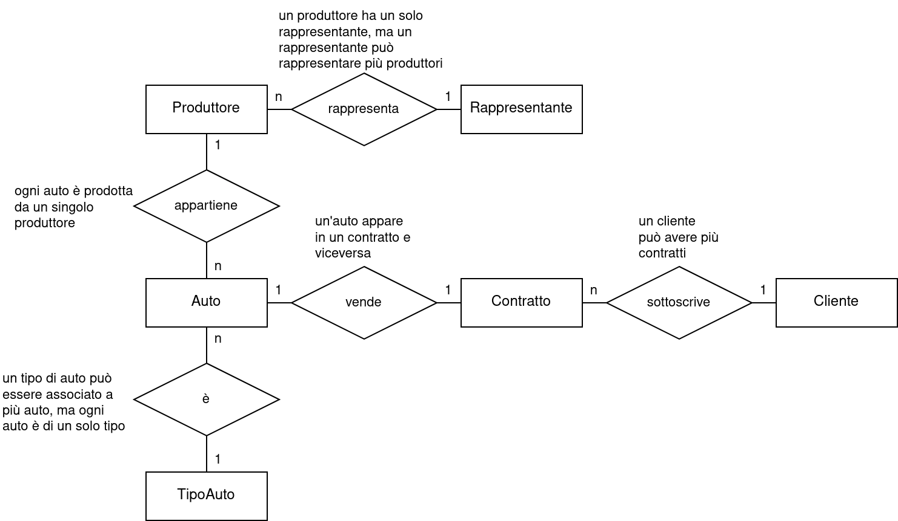

<style>
:root {
  font-family: 'SF Pro Text', serif !important;
}

code {
   font-family:  "Fantasque Sans Mono", monospace !important;
}

h1 {
  font-size: 2.5em !important;
  color: #1E1E1E !important;
}

section{
  justify-content: flex-start;
}

img[alt~="right"] {
  display: block;
  margin: 0 0;
  float: right;
}

img[alt~="center"] {
  display: block;
  margin: 0 auto;
}
</style>

# Esercizio

---

Mario possiede una concessionaria di auto e vuole implementare un database per conservare le informazioni anagrafiche dei suoi clienti e dei contratti di vendita da loro sottoscritti, la concessionaria propone i modelli di auto di diversi produttori d'auto. Il database ha organizzato i modelli d'auto per tipo, per ogni tipo si registrano informazioni quali: descrizione del tipo, consigli per la guida e istruzioni per la manutenzione. Nel database si conservano le informazioni sui produttori europei d'auto e del relativo rappresentante di zona da cui la concessionaria acquista le auto e quelle sui tipi d'auto. Il database deve poter essere interrogato per permettere di estrarre le seguenti informazioni:

---

- elenco clienti ordinato per cognome e nome
- elenco dei clienti che si chiamano Rossi nati nel 1940
- nome e cognome del cliente il cui numero telefonico contiene le cifre 34567
- elenco modelli auto con cilindrata compresa fra i 1200 e i 1800 cc
- elenco dei modelli di auto con un prezzo minore di 14000 euro e che sono fiat o citroen
- nome,cognome e n.telefono di tutti i rappresentanti di zona la cui sede è a milano o a roma o a venezia
- numero di auto che il signor rossi codice 1234 ha comprato
- clienti che hanno acquistato un'auto fiat di tipo sportiva nel mese di marzo 2015

---
Quindi:
- Implementa il modello E/R
- Deriva quello Relazionale
- Risolvi le interrogazioni in SQL

---

## Modello E/R



---

## Modello relazionale

- Cliente(**CodiceCliente**, Nome, Cognome, AnnoNascita, Telefono)
- Contratto(**CodiceContratto**, Data, CodiceCliente[FK], Auto[FK])
- Auto(**Targa**, Modello, Prezzo, Cilindrata, Produttore[FK], Tipo[FK])
- Produttore(**CodiceProduttore**, NomeProduttore, Rappresentante[FK])
- Rappresentante(**CodiceRappresentante**, NomeRappresentante, Sede)
- TipoAuto(**CodiceTipo**, Descrizione, ConsigliGuida, IstruzioniManutenzione)

---

## DDL

```sql
CREATE TABLE Cliente (
    CodiceCliente INT PRIMARY KEY,
    Nome VARCHAR(20),
    Cognome VARCHAR(20),
    AnnoNascita INT,
    Telefono VARCHAR(20)
);

CREATE TABLE Rappresentante (
    CodiceRappresentante INT PRIMARY KEY,
    NomeRappresentante VARCHAR(20),
    Sede VARCHAR(20)
);

CREATE TABLE TipoAuto (
    CodiceTipo INT PRIMARY KEY,
    Descrizione VARCHAR(20),
    ConsigliGuida VARCHAR(20),
    IstruzioniManutenzione VARCHAR(20)
);
```
---
```sql
CREATE TABLE Produttore (
    CodiceProduttore INT PRIMARY KEY,
    NomeProduttore VARCHAR(20),
    Rappresentante INT,
    FOREIGN KEY (Rappresentante) REFERENCES Rappresentante(CodiceRappresentante)
);

CREATE TABLE Auto (
    Targa VARCHAR(20) PRIMARY KEY,
    Modello VARCHAR(20),
    Prezzo INT,
    Cilindrata INT,
    Produttore INT,
    Tipo INT,
    FOREIGN KEY (Produttore) REFERENCES Produttore(CodiceProduttore),
    FOREIGN KEY (Tipo) REFERENCES TipoAuto(CodiceTipo)
);

CREATE TABLE Contratto (
    CodiceContratto INT PRIMARY KEY,
    Data DATE,
    CodiceCliente INT,
    Targa VARCHAR(20),
    FOREIGN KEY (CodiceCliente) REFERENCES Cliente(CodiceCliente),
    FOREIGN KEY (Targa) REFERENCES Auto(Targa)
);
```
---

## Interrogazioni
```sql
-- 1) Elenco clienti ordinato per cognome e nome
SELECT * FROM Cliente
ORDER BY Cognome, Nome;

-- 2) Clienti che si chiamano Rossi nati nel 1940
SELECT * FROM Cliente
WHERE Cognome = 'Rossi' AND AnnoNascita = 1940;

-- 3) Nome e cognome del cliente il cui numero telefonico contiene le cifre 34567
SELECT Nome, Cognome
FROM Cliente
WHERE Telefono LIKE '%34567%';

-- 4) Elenco modelli auto con cilindrata compresa fra i 1200 e i 1800 cc
SELECT * FROM Auto
WHERE Cilindrata BETWEEN 1200 AND 1800;
```

---

```sql
-- 5) Modelli di auto con prezzo minore di 14000 euro e che sono fiat o citroen
SELECT * FROM Auto
WHERE Prezzo < 14000 AND (Produttore IN ('Fiat', 'Citroen'));

-- 6) Nome, cognome e n.telefono di rappresentanti di zona a Milano, Roma o Venezia
SELECT Nome, Cognome, Telefono
FROM Rappresentante
WHERE Sede IN ('Milano', 'Roma', 'Venezia');

-- 7) Numero di auto che il signor Rossi codice 1234 ha comprato
SELECT COUNT(*)
FROM Acquista A, Cliente C
WHERE C.CodiceCliente = A.CodiceCliente
AND C.Cognome = 'Rossi' AND C.CodiceCliente = 1234;

-- 8) Clienti che hanno acquistato un'auto fiat di tipo sportiva nel marzo 2015
SELECT C.*
FROM Cliente C, Acquista A, Auto Au, TipoAuto T
WHERE C.CodiceCliente = A.CodiceCliente AND A.Targa = Au.Targa AND Au.Modello = T.Targa
AND T.Descrizione = 'Sportiva' AND MONTH(A.Data) = 3
AND YEAR(A.Data) = 2015 AND Au.Produttore = 'Fiat';
```