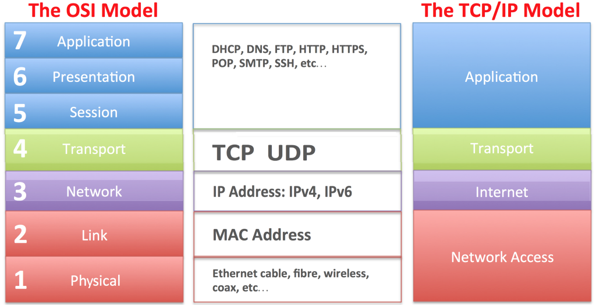

# ISO/OSI

---

## Il modello ISO/OSI

Il modello ISO/OSI è un modello di riferimento per la progettazione dei protocolli di rete. Il modello è stato sviluppato dall'ISO (International Organization for Standardization) nel 1984 e si basa su un'architettura a livelli.
A differenza del modello TCP/IP, ISO/OSI è un modello concettuale che non viene praticamente utilizzato per la comunicazione, mentre TCP/IP viene utilizzato fiiscamente per stabilire una connessione e comunicare attraverso la rete.

---

## Il modello ISO/OSI

Possiamo mettere a confronto il modello ISO/OSI con il modello TCP/IP

---

## Il modello ISO/OSI

Il modello ISO/OSI è composto da 7 livelli:

- **Livello applicazione**: è il livello più alto del modello ISO/OSI. Il livello applicazione è il livello che interagisce con l'utente. Grazie a questo livello gli utenti possono accedere alla rete utilizzando interfacce e servizi come posta elettronica, database, accesso/trasferimento di file...
- **Livello presentazione**: il livello presentazione si occupa di convertire i dati in un formato che possa essere comprensibile dal livello applicazione. Inoltre, il livello presentazione si occupa di crittografare i dati per garantire la sicurezza della comunicazione.
- **Livello sessione**: il livello sessione si occupa di stabilire, mantenere e terminare le sessioni di comunicazione tra due applicazioni. Il livello sessione si occupa di gestire le interruzioni di comunicazione e di sincronizzare i dati.

---

## Il modello ISO/OSI

- **Livello trasporto**: accetta i dati dal livello precedente sotto forma di pacchetti e li trasmette al livello successivo nell’ordine corretto. Le altre funzioni svolte da questo livello sono l’indirizzamento del punto di servizio, il controllo della connessione, la segmentazione e il riassemblaggio, il controllo del flusso e il controllo degli errori.
- **Livello rete**: l’indirizzamento logico e il routing sono le principali operazioni eseguite dal livello di rete. Traduce l’indirizzo logico di rete in un indirizzo MAC fisico in modo che anche due sistemi che risiedono in diverse reti possano comunicare in modo efficiente.

---
## Il modello ISO/OSI

- **Livello collegamento**: è responsabile della trasformazione del servizio di trasmissione grezzo (livello fisico) in un collegamento affidabile. Rende il livello fisico esente da errori mascherandoli in modo che il livello di rete non li noti. In questo livello, i dati di input vengono suddivisi in frame. Le attività svolte nel livello di collegamento dati sono il framing, il controllo degli accessi, l’indirizzamento fisico, gli errori e il controllo del flusso.
- **Livello fisico**: è il livello più basso del modello ISO/OSI. Il livello fisico è responsabile della trasmissione dei bit grezzi attraverso un canale di comunicazione. Questo livello definisce le specifiche elettriche, meccaniche, procedurali e funzionali per l’attivazione, la manutenzione e la disattivazione di un collegamento fisico tra due dispositivi di rete.

---

## TCP/IP

Il modello TCP/IP (Transimit Control Protocol/Internet Protocol) è il modello di riferimento per la progettazione dei protocolli di rete. Il modello è stato sviluppato dal DARPA (Defense Advanced Research Projects Agency) nel 1970 e si basa su un'architettura a livelli.
Come visto prima, i livelli ISO/OSI applicazione, presentazione e sessione sono condensati in un unico livello nel modello TCP/IP, chiamato livello applicazione, mentre i livelli collegamento e fisico sono condensati in un unico livello, chiamato livello accesso alla rete.

---

## Incapsulamento e decapsulamento

Ogni livello del modello ISO/OSI o del protocollo TCP/IP aggiunge un'intestazione ai dati ricevuti dal livello superiore. Questo processo è chiamato **incapsulamento**. Quando i dati vengono ricevuti, le intestazioni vengono rimosse, questo processo è chiamato **decapsulamento**.
L'header di ogni livello prende il nome di PDU (Protocol Data Unit), e ogni livello ha un nome diverso per la PDU:

- **Livello applicazione**: Messaggio
- **Livello trasporto**: Segmento
- **Livello rete**: Pacchetto
- **Livello collegamento**: Frame

---

## Applicazioni di rete

Un'applicazione di rete è costituita da due o più processi che comunicano tra loro attraverso la rete. Questi processi operano interagendo tra loro utilizzando delle risorse comuni, come ad esempio un database. 
Le applicazioni di rete vengono anche chiamate applicazioni distribuite, dato che vengono eseguite su più elaboratori.
Esempi di applicazioni di rete sono:
- Posta elettronica
- FTP
- Telnet
- Voice over IP

---

## Applicazioni di rete

I processi hanno la necessità di scambiare messaggi con gli altri procesi della medesima applicazione, sia che essi appartengano alla stessa rete locale, sia che appartengano a reti diverse. Per comunicare tra loro, i processi utilizzano i servizi offerti dal livello applicazione.

---

## Architettura delle applicazioni di rete

Ci sono tre tipi di architettura per le applicazioni di rete:
- **Client-server**
- **Peer-to-peer**
- **Ibrida**

---

## Architettura client-server

Nell'architettura client-server, il server è sempre attivo e in ascolto di richieste da parte dei client. Un esempio di questa architettura è il web, dove moltepici server, o anche solo uno, possiedono le pagine che vengono poi inviate ai client che le richiedono.
Un client non comunica con altri client, ma solo con il server, più client possono comunicare con lo stesso server.

---

## Architettura peer-to-peer

Nell'architettura peer-to-peer, i client comunicano direttamente tra loro senza l'ausilio di un server. Peer-to-peer significa letteralmente "pari a pari". Un esempio di questa architettura è BitTorrent, dove i client si scambiano i file direttamente tra loro senza l'ausilio di un server.

---

## Architettura peer-to-peer

Esistono tre tipi di architettura peer-to-peer:

- **Decentralizzata**: i client si scambiano i file direttamente tra loro senza l'ausilio di un server. Ogni client ha funzioni sia di client che di server. Un esempio di questa architettura è appunto BitTorrent.
- **Centralizzata**: i client si scambiano i file direttamente tra loro, ma esiste un server che tiene traccia dei file presenti nei client. Un esempio di questa architettura è Napster.
- **Ibrida**: alcuni peer detti supernodi vengono determinati dinamicamente e si occupano di tenere traccia dei file presenti nei client, gli altri peer sono chiamati leaf peer o nodi foglia.

---

## Servizi offerti dal livello applicazione

Ogni applicazione deve scegliere tra i protocolli di trasporto quale deve adottare per realizzare un protocollo applicativo, in base alle esigenze dell'applicazione stessa. Le esigenze possono essere riassunte in:

- **Affidabilità**: l'applicazione richiede che i dati siano consegnati senza errori.
- **Banda**: l'applicazione richiede una certa banda per funzionare correttamente.
- **Tempo di consegna**: l'applicazione richiede che i dati siano consegnati entro un certo tempo.
- **Sicurezza**: l'applicazione richiede che i dati siano consegnati in modo sicuro.

---

## Affidabilità

Con trasferimento affidabile si intende un servizio che garantisce che i dati vengano consegnati in modo completo e corretto. Alcune applicazioni richiedono un trasferimento affidabile, altre no. Ad esempio, un'applicazione di posta elettronica non tollera la perdita di dati, mentre un'applicazione di streaming video può tollerare la perdita di alcuni dati.
Per questo il livello trasporto offre due protocolli di trasporto:

- **UDP**: è un protocollo di trasporto senza connessione, non offre un trasferimento affidabile, controllo del flusso, della congestione, del ritardo, banda minima e l'ordine di consegna dei pacchetti. È un protocollo molto veloce e leggero.
- **TCP**: è un protocollo di trasporto orientato alla connessione, offre un trasferimento affidabile, controllo del flusso, della congestione, del ritardo e l'ordine di consegna dei pacchetti. È un protocollo più lento e pesante di UDP.

---

## Banda

La banda è la quantità di dati che possono essere trasmessi in un certo intervallo di tempo. Alcune applicazioni richiedono una certa banda per funzionare correttamente, altre no. Ad esempio, un'applicazione di posta elettronica non richiede una certa banda, mentre un'applicazione di streaming video richiede una certa banda per funzionare correttamente.

---

## Tempo di consegna

Il tempo di consegna è il tempo che intercorre tra l'invio di un messaggio e la sua ricezione. Alcune applicazioni richiedono che i dati vengano consegnati entro un certo tempo, altre no. Ad esempio, un'applicazione di posta elettronica non richiede che i dati vengano consegnati entro un certo tempo, mentre un'applicazione di telefonia voip o videogiochi online richiedono che i dati vengano consegnati entro un certo tempo.
Lo strato di trasporto non può garantire un tempo di consegna.
Il protocollo TCP garantisce la consegna, ma non il tempo, mentre il protocollo UDP non garantisce né la consegna né il tempo, ma è molto più veloce di TCP.
La soluzione migliore è quella di utilizzare UDP e implementare un meccanismo di controllo del tempo di consegna a livello applicazione.

---

## Sicurezza

La sicurezza è la capacità di un sistema di proteggere i dati da accessi non autorizzati. Alcune applicazioni richiedono che i dati vengano consegnati in modo sicuro, altre no. Ad esempio, un'applicazione di posta elettronica non richiede che i dati vengano consegnati in modo sicuro, mentre un'applicazione di home banking lo richiede.
Lo strato di trasporto non può garantire la sicurezza.

---

## Conclusione

Riportiamo in tabella i requisiti richiesti al servizio di trasporto dalle applicazioni di rete:

| Applicazione | Affidabilità | Banda | Tempo di consegna | Sicurezza |
|--------------|--------------|-------|-------------------|-----------|
| Posta elettronica | Sì | No | No | No |
| Streaming video | No | Sì | No | No |
| Telefonia VoIP | No | No | Sì | No |
| Videogiochi online | No | No | Sì | No |
| Home banking | Sì | No | No | No |
| Messaggistica istantanea | No | No | No | No |