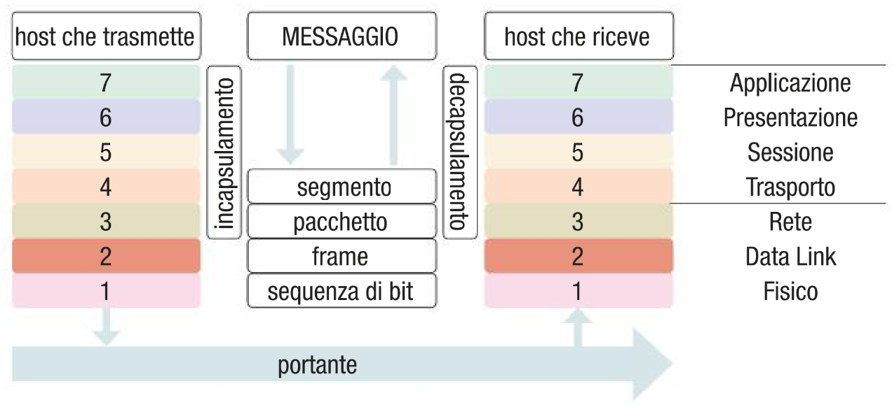
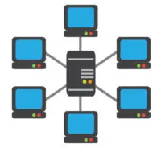
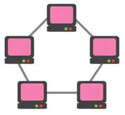
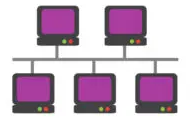
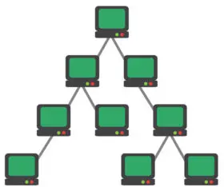
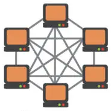
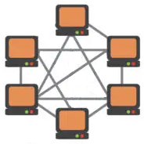
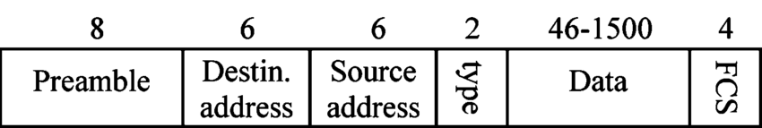
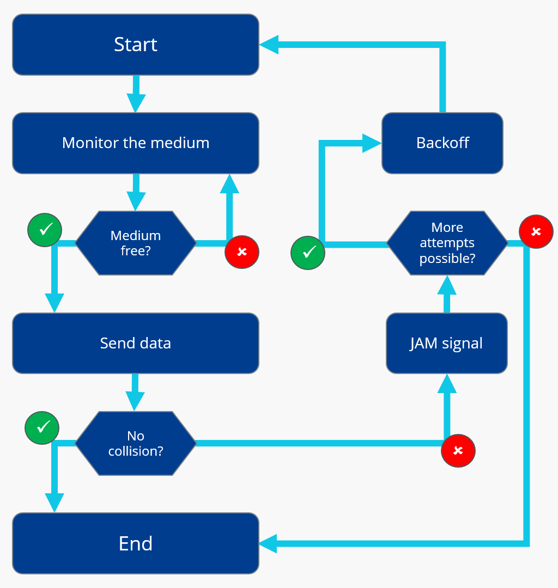

# Reti di computer

---

## La comunicazione e le reti
In termini generali per comunicazione si intende lo scambio di informazioni tra due o più interlocutori, un dispositivo sorgente e un destinatario. Per comunicare è necessaria la presenza di un mezzo di comunicazione.

> Una rete di computer è un sistema di comunicazione di dati che consente a un certo numero di dispositivi indipendenti detti **host** di comunicare direttamente tra loro.

Oltre ai computer, una rete è costituita da altri dispositivi, detti **nodi**, che svolgono funzioni di supporto alla comunicazione. I nodi possono essere router, switch, hub, stampanti, ecc. Quando una rete ospita diversi elementi, ciascuno con un compito specifico, si parla di **rete strutturata**.

---

L'utilizzo di computer connessi in rete consente di migliorare e potenziare le funzionalità dei singoli computer.

| Vantaggi | Svantaggi |
| --- | --- |
| Condivisione di risorse hardware come cartelle, stampanti, ecc. | Necessità di un amministratore di rete |
| L'uso condiviso di servizi come la posta elettronica, la messaggistica istantanea, il web, ecc. | Implementare adeguatamente le politiche di protezione del sistema (privacy e sicurezza) |
| Centralizzazione nella gestione degli utenti | |
| Scambio di informazioni tra utenti | |

---

## Trasmissione dei dati
Le configurazioni di rete possono essere di tre tipi:
- **Punto-punto(point-to-point)**: due host sono collegati direttamente tra loro
- **Broadcast**: un host invia un messaggio a tutti gli altri host della rete
- **Multicast**: un host invia un messaggio a un gruppo di host

---

## Linee di comunicazione
La trasmissione avviene inoltre mediante linee di comunicazione, che, in base alla direzione in cui viaggiano i dati e alla simultaneità o meno della trasmissione, possono essere suddivise in tre grandi tipologie:
- **Simplex**: i dati viaggiano in una sola direzione
- **Half-duplex**: i dati viaggiano in entrambe le direzioni, ma non contemporaneamente
- **Full-duplex**: i dati viaggiano in entrambe le direzioni, contemporaneamente

Un esempio di linea di comunicazione simplex è la televisione, un esempio di linea di comunicazione half-duplex è il walkie-talkie, e infine un esempio di linea di comunicazione full-duplex è la linea telefonica.

---

## Commutazione
> La commutazione è la capacità di una rete di creare, mantenere e interrompere il collegamento tra i diversi nodi che la compongono

La commutazione si esegue mediante particolari funzioni, o di indirizzamento o di instradamento, che consentono di stabilire il percorso che i dati devono seguire per raggiungere la destinazione.

---

Principlamente esistono tre tipi di commutazione:
- **Commutazione di circuito**: il collegamento tra due host è stabilito prima della trasmissione dei dati
- **Commutazione di messaggio**: il collegamento tra due host è stabilito solo durante la trasmissione dei dati
- **Commutazione di pacchetto**: il collegamento tra due host è stabilito solo durante la trasmissione dei dati, ma i dati sono suddivisi in pacchetti

---

## Commutazione di circuito

Nella commutazione di circuito il canale trasmissivo è interamente dedicato a un solo tipo di trasmissione. Per esempio, quando si effettua una telefonata, durante la conversazione si instaura tra i due interlocutori un canale di comunicazione interamente dedicato alla trasmissione dei dati-voce tra i due.

La commutazione di circuito offre alcuni vantaggi per il dialogo:
- le procedure di controllo sono necessarie soltanto all’inizio e al termine della chiamata;
- il canale trasmissivo (circuito), essendo dedicato, garantisce affidabilità e sicurezza;
- il tempo di trasferimento dei dati è costante, dipende unicamente dalla distanza.

---

Per contro, la commutazione di circuito offre:
- minore flessibilità della velocità di comunicazione, perché questa non può essere fatta variare se non attivando più circuiti in parallelo;
- minore efficienza: il canale trasmissivo può essere sotto-utilizzato se circolano pochi dati, o addirittura nessun dato. Pensiamo per esempio al circuito che collega il nostro telefono fisso a quello del chiamato: durante una conversazione, quest’ultimo è utilizzato per una percentuale di tempo dell’ordine del 30-40%: mediamente durante una telefonata si parla e si ascolta all’incirca al 50%, quindi non si utilizza il circuito in ciascuna direzione all’incirca per il 50% del tempo.

---

## Commutazione di pacchetto

Nella commutazione di pacchetto i dati sono suddivisi in pacchetti, che vengono inviati singolarmente e indipendentemente l’uno dall’altro. I pacchetti possono seguire percorsi diversi per raggiungere la destinazione, e possono arrivare in ordine diverso rispetto a quello di invio. L'host di destinazione provvede a riordinare i pacchetti e a ricostruire il messaggio originale.

I pacchetti oltre ai dati contengono anche una parte di **header**, che contiene informazioni come l'indirizzo di destinazione, l'indirizzo di origine, la dimensione del pacchetto, ecc.
La tecnica di scomposizione dei pacchetti è denominata multiplazione (multiplexing).

---

La commutazione di pacchetto ottimizza l’impiego della rete, perché consente a host diversi la trasmissione contemporanea di più messaggi sullo stesso mezzo trasmissivo. Inoltre utilizza le risorse di rete in maniera molto più flessibile rispetto alla commutazione di circuito, ma è meno trasparente in quanto i canali di trasmissione vengono condivisi in maniera dinamica da più host.

Questa tecnica di commutazione trova applicazione in Internet, dove la trasmissione dei dati avviene segmentando i dati in pacchetti di lunghezza massima 1500 Byte. Viene definito un limite alla dimensione dei pacchetti per non permettere ad una singola trasmissione di monopolizzare l’uso del mezzo trasmissivo per un tempo lungo, bloccando così il resto del traffico.

---

## Il concetto di protocollo

> Un protocollo è un insieme di regole che definisce il formato e l’ordine dei messaggi scambiati tra due o più entità comunicanti, così come le azioni intraprese sulla ricezione o sull’invio di un messaggio o di un altro evento.

Un protocollo di rete, più precisamente, definisce:
- la formazione e la codifica dei messaggi;
- la rilevazione e la correzione degli errori;
- l’instradamento dei messaggi attraverso la rete.

Un esempio di protocollo può essere l'alfabeto morse, che definisce un insieme di regole per la comunicazione tra due interlocutori.

---

## Il modello OSI

L’ente ISO (International Organization for Standardization) ha definito nel 1988 uno standard di protocolli utilizzati per la comunicazione tra sistemi elaborativi che ancora oggi rappresenta il riferimento progettuale per le architetture delle reti.

Attraverso il cosiddetto modello di riferimento ISO-OSI abbiamo a disposizione delle regole che permettono di comunicare anche a sistemi di elaborazione diversi e incompatibili tra di loro.

l modello ISO-OSI è basato su tre cardini fondamentali.
1. modularità
2. simmetria
3. struttura gerarchica

---

La **modularità** garantisce che ogni livello abbia ben definite non solo le proprie funzioni interne, ma anche le interfacce con cui riceve o trasmette i comandi e i dati verso i livelli adiacenti. Questo implica che, per aggiungere opzioni o per permettergli prestazioni migliori grazie a nuove tecnologie, non è necessario modificare anche gli altri livelli.

La **simmetria** assicura che le funzioni logiche di due qualsiasi sistemi interagenti siano le stesse, in accordo con gli standard

La **struttura gerarchica** identifica livelli o strati diversi, organizzati in una rigida gerarchia operativa. Ciascun livello riceve i comandi e i dati dal livello superiore, esegue per esso alcuni servizi e, a sua volta, chiede servizi al livello subordinato. Ad ogni livello non importa come tali servizi vengono forniti.

---

## Livelli

Nei sette strati funzionali del modello ISO/OSI possiamo individuare due sottogruppi, rappresentati dai quattro strati più alti e dai tre strati inferiori.
Il gruppo superiore di strati prende il nome di gruppo di alto livello o gruppo di elaborazione ed è formato dai seguenti strati:

- Applicazione (Application): rappresenta lo strato intermedio verso l’utente dei vari protocolli sottostanti. Fornisce il supporto per i programmi applicativi come il browser, il programma di trasferimento dei file ecc.
- Presentazione (Presentation): si occupa della sintassi dell’informazione trasferita. Comprende (opzionalmente) la compressione e la cifratura dei dati.
- Sessione (Session): fornisce i mezzi a due applicazioni eseguite in due diversi nodi della rete per organizzare, sincronizzare e regolare lo scambio di dati.

---

- Trasporto (Transport): garantisce che i messaggi scambiati dallo strato sessione siano privi di errore e che non ci siano ripetizioni o mancanze, indipendentemente dal tipo di rete sottostante. Ha il compito di garantire l’affidabilità della comunicazione.

Il sottogruppo del modello ISO-OSI rappresentato dai tre layer inferiori prende il nome di gruppo di basso livello o gruppo di trasferimento ed è rappresentato dai seguenti
strati:
-  Rete (Network): si occupa delle procedure di indirizzamento, instradamento e controllo di flusso. Consente di connettere due sistemi a una o più reti, garantendo al livello superiore (Transport) un servizio uniforme.
- Collegamento dati (Data link): fornisce il mezzo per il trasferimento dei dati sulla connessione fisica sottostante. Comprende la sincronizzazione di bit, di parola e di trama, e il controllo degli errori.

---

- Fisico (Physical): effettua il collegamento fisico tra gli elementi della rete e il mezzo fisico (detto portante). Deve soddisfare i vincoli meccanici ed elettrici del portante stesso

Su un host, lo scambio delle informazioni, chiamate anche “primitive”, avviene solo ed esclusivamente tra strati adiacenti. Per esempio, lo strato 2, in trasmissione, offre un servizio al livello 3 e a sua volta utilizza il servizio di trasporto sul mezzo fisico offerto dallo strato 1. Lo strato 2 non conosce l’identità degli strati superiori al 3, in quanto con i livelli 4, 5, 6 e 7 non ha alcuna interazione diretta.

Quando due host devono comunicare, la stratificazione introdotta dal modello ISO/OSI impone che ogni livello dei due host dialoghi unicamente con il proprio pari livello.

---

## Livello fisico

Il livello fisico riceve dal livello immediatamente superiore i pacchetti di bit, che converte in segnali elettrici od ottici da trasmettere mediante il mezzo trasmissivo.
Il servizio fornito da questo livello fisico è la trasmissione delle sequenze di bit pacchettizzate da una parte all’altra del collegamento, senza curarsi di eventuali errori dovuti all’interferenza dei campi magnetici ed elettrici. Definisce invece le caratteristiche fisiche del mezzo trasmissivo.

---

## Livello di collegamento
Il livello immediatamente superiore, il livello di collegamento (Data link), riceve i pacchetti di dati dal livello adiacente superiore e definisce la struttura del messaggio dividendolo in frame, a loro volta suddivisi in campi, destinati al livello fisico. Ogni frame ha un proprio significato e un proprio compito, per cui il messaggio
da trasmettere inizia ad acquisire un senso compiuto.

A questo livello si esegue un controllo sulla presenza di errori nei frame e si mettono in atto le soluzioni per correggerli. Si gestisce inoltre la modalità di trasmissione tra dispositivi che lavorano a velocità diverse.

Il livello Data link è suddiviso in due sottolivelli:
- LLC (Logical Link Control)
- MAC (Media Access Control)

---

## Livello di rete

Il livello di rete riceve i pacchetti di dati dal livello adiacente superiore e li elabora per passarli a quello inferiore. Il suo compito è di instradare (routing) i dati verso la destinazione selezionando il percorso di rete più opportuno dal momento che quando vi sono più reti connesse tra sorgente e destinazione si possono seguire più percorsi alternativi per mettere in collegamento due host.
Il livello di rete si occupa inoltre del multiplexing, di controllare la congestione della rete e di interconnettere le reti (internetworking).

---

## Livello di trasporto

I pacchetti in cui è scomposto il dato da trasmettere viaggiano sul canale, numerati progressivamente: in generale, poiché possono seguire percorsi differenti, non è detto che arrivino a destinazione nello stesso ordine in cui sono partiti. Al livello di trasporto si provvede allora a effettuare la ricostruzione esatta dei pacchetti, gestendo eventuali trasmissioni corrotte in modo da fornire un servizio affidabile al successivo livello di sessione.

---

## Livello di sessione

Oltre all’instradamento di un messaggio, per realizzare la comunicazione occorre gestire il “dialogo” fra mittente e destinatario. Questo compito è assolto dal livello di sessione, che apre e chiude connessioni logiche (sessioni di lavoro) tra il nodo e la rete, come quando ci connettiamo a un servizio web effettuando il login. Per fare ciò usa il corrispondente protocollo, gestendo il dialogo anche mediante punti di sincronizzazione intermedi, da ciascuno dei quali sia possibile far ripartire il trasferimento dei dati in caso di errore.

---

## Livello di presentazione
Questo livello si occupa della sintassi e della semantica delle informazioni da trasferire sulla rete (gli altri livelli gestiscono sequenze di bit). Si occupa inoltre di comprimere e cifrare i dati.
L’informazione da consegnare viene fatta precedere da un’intestazione che indica la quantità, la natura e la lunghezza di ogni singolo campo che compone la struttura dati.

---

## Livello di applicazione
L’ultimo livello della pila ISO-OSI è quello che si interfaccia con l’utente della rete e le sue applicazioni. Sono stati definiti protocolli specifici di livello Application per varie tipologie di applicazioni, come il file transfer, l’accesso ai database, l’email.
Il livello di applicazione ha la funzione di scambiare i risultati tra i programmi in un modello client/server.

---

## Incapsulamento

Il processo di incapsulamento è il processo mediante il quale i dati vengono suddivisi in pacchetti e vengono aggiunti gli header dei vari livelli. Il processo inverso, mediante il quale i dati vengono ricostruiti, è detto decapsulamento.

Il singolo pacchetto, durante il suo viaggio da un host a un altro, partendo dal livello più alto della struttura dell’host di partenza (livello di applicazione) percorre in ordine tutti i livelli sottostanti fino ad arrivare al livello fisico, per poi raggiungere il livello fisico dell’host di destinazione tramite il mezzo trasmissivo. Tale percorso viene compiuto a ritroso nel messaggio di risposta dell’host, fino a raggiungere nuovamente il livello applicazione del mittente.

---

## Incapsulamento

Il pacchetto, nel percorrere i diversi livelli, subisce l’incapsulamento.
In corrispondenza di ogni strato della struttura che attraversa, al pacchetto dell’host mittente vengono aggiunte delle informazioni proprie del livello attraversato. Il pacchetto viene incapsulato nel senso che vengono man mano aggiunte nuove informazioni, una dentro l’altra, come una matrioska. Viceversa, quando il pacchetto giunge a destinazione, durante il percorso di risalita, viene decapsulato dai vari livelli e vengono estratte le informazioni utili al livello specifico, fino a ottenere il pacchetto originale. Perciò, in ogni livello, il pacchetto assume nomi identificativi differenti.

---
## Incapsulamento

---

## Classificazione delle reti

Le reti possono essere classificate in base a diversi criteri:
- Per dimensione
- Per topologia
- Per modello (client/server o peer-to-peer)

---

## Classificazione delle reti per dimensione

Le reti possono essere classificate in base alla loro dimensione in:
- NFC (Near Field Communication)
- BAN (Body Area Network)
- PAN (Personal Area Network)
- HAN (Home Area Network)
- LAN (Local Area Network)
- WAN (Wide Area Network)
- GAN (Global Area Network)

---

### NFC (Near Field Communication)
Si tratta di una tecnologia di comunicazione wireless a corto raggio (circa 10 cm) che permette lo scambio di dati tra dispositivi elettronici. L'esempio più comune è il pagamento contactless attraverso lo smartphone.

### BAN (Body Area Network)
Si tratta di una rete di dispositivi elettronici indossabili che comunicano tra loro. Un esempio è il fitness tracker, lo smartwatch, e in generale tutti i wearable. La distanza massima tra i dispositivi è di circa 2 metri.

### PAN (Personal Area Network)
Si tratta di una rete di dispositivi elettronici che comunicano tra loro. Un esempio è la rete bluetooth. La distanza massima tra i dispositivi è di circa 10 metri.

---

### HAN (Home Area Network)
Si tratta di una rete di dispositivi elettronici che comunicano tra loro all'interno di una casa. Un esempio è la rete Wi-Fi, la cui distanza massima tra i dispositivi è di circa 100 metri. Vengono utilizzate tecnologie sia cablate che wireless. Comprende dispositivi come computer, stampanti, smart TV, smartphone, ecc.

### LAN (Local Area Network)
Si tratta di una rete di dispositivi elettronici che comunicano tra loro all'interno di un edificio o di un campus. Vengono utilizzate tecnologie sia cablate che wireless. Spesso data la dimensione della rete, vengono utilizzati dispositivi di rete come router, switch, hub, ecc.

---

### WAN (Wide Area Network)
Una rete WAN è composta da due o più reti LAN interconnesse tra loro, connesse tramite linee dedicate o in generale tramite internet. Le reti WAN possono essere utilizzate per collegare sedi distanti tra loro, come ad esempio le sedi di un'azienda.

### GAN (Global Area Network)
Sono reti che collegano tra loro dispositivi sparsi in tutto il mondo. Un esempio è internet.

---

<!--  -->

## Classificazione delle reti per topologia
Una topologia di rete è la struttura fisica o logica di una rete, che definisce il modo in cui i nodi sono collegati tra loro. Le topologie di rete più comuni sono:
- A stella
- Ad anello
- A bus
- Ad albero
- A maglia (Completamente connessa o parzialmente connessa)

---

### Topologia a stella

Una rete a stella possiede un elemento comune centrale (hub o switch) al quale sono connessi tutti gli altri nodi. Tutti i dati che transitano sulla rete devono passare attraverso il nodo centrale. Se il nodo centrale non funziona, tutta la rete non funziona. La connessione o disconnessione di un nodo non influisce sul funzionamento della rete.

---

### Topologia ad anello

Una rete ad anello è una rete in cui ogni nodo è connesso ai due nodi adiacenti e ogni nodo funge da ripetitore per i dati. Se i dati viaggiano in un'unica direzione (Rete ad anello unidirezionale) quando un nodo non funziona, tutta la rete non funziona. Se i dati viaggiano in entrambe le direzioni (Rete ad anello bidirezionale) quando un nodo non funziona, la rete continua a funzionare, ma se ne cade un secondo, la rete non funziona più.
Per poter connettere un nuovo nodo alla rete è necessario interrompere la rete e modificare i due host adiacenti, rendendo la rete poco flessibile.

---

### Topologia a bus

Una rete a bus è una rete in cui tutti i nodi sono connessi ad un unico cavo, chiamato appunto bus o dorsale. Se il cavo si rompe, tutta la rete non funziona. In questo tipo di reti è necessario utilizzare dei terminatori per evitare che i segnali si riflettano e interferiscano con i dati in transito. Può comunicare un solo nodo alla volta, per cui se due nodi trasmettono contemporaneamente, i dati si sovrappongono e non sono più leggibili (Collisione). I dati trasmessi sono ricevuti da tutti i nodi della rete, ma solo il nodo destinatario li accetta.

---

### Topologia ad albero

Una rete ad albero è una rete in cui i nodi sono collegati tra loro in modo gerarchico, in modo da formare una struttura ad albero. La rete è composta da un nodo radice, che è il nodo principale, e da nodi interni, che sono i nodi intermedi, e da nodi foglia, che sono i nodi finali. I dati viaggiano dal nodo radice ai nodi foglia. Se il nodo radice non funziona, tutta la rete non funziona. In generale, se un nodo non funziona, tutti i nodi che dipendono da esso non funzionano.

---

### Topologia a maglia completa

Una rete a maglia completa è una rete in cui ogni nodo è connesso a tutti gli altri nodi. Se un nodo non funziona o un cavo si rompe, la rete continua a funzionare.  Per poter connettere un nuovo nodo alla rete è necessario creare un numero di connessioni pari al numero di nodi già presenti nella rete, rendendo la rete poco flessibile ed estremamente costosa.

---

### Topologia a maglia parziale

Una rete a maglia parziale è una rete in cui quasi ogni nodo è connesso a quasi tutti gli altri nodi. È meno costosa di una rete a maglia completa, più flessibile, ma meno resistente ad un guasto.

---

## Classificazione delle reti per modello

Le reti **client/server** sono basate sul ruolo di alcuni host che svolgono la mansione di server, per fornire ad altri host alcuni servizi. Nelle reti di modello client/server il server, rimanendo sempre acceso e accessibile agli altri host, chiamati client, fornisce servizi a richiesta. Ad esempio un server web fornisce pagine web a richiesta dei client, un server di posta elettronica fornisce la possibilità di inviare e ricevere email, ma esistono anche server di stampa, server di database, ecc.

Le reti **peer-to-peer** sono basate sul concetto di parità tra i vari host, che possono svolgere sia il ruolo di client che di server. In questo tipo di reti non esiste un server centrale, ma ogni host può fornire servizi agli altri host. Ad esempio, in una rete peer-to-peer, un host può condividere una cartella con gli altri host, che possono accedervi e scaricare i file contenuti.

---

## Tecniche di accesso al mezzo trasmissivo
Le principali tecnologie di accesso multiplo al canale sono:
- A divisione di tempo (TDMA)
- A divisione di frequenza (FDMA)
- Polling
- Token passing

---

### TDMA (Time Division Multiple Access)

La tecnica TDMA prevede che il canale trasmissivo venga diviso in intervalli di tempo, chiamati slot, che vengono assegnati ai vari host. Gli host devono essere sincronizzati tra loro, in modo che tutti gli host sappiano quando inizia e quando finisce il proprio slot. Ogni host può trasmettere solo durante il proprio slot di tempo e se un host non ha dati da trasmettere, il suo slot rimane vuoto.

---

### FDMA (Frequency Division Multiple Access)

La tecnica FDMA prevede che il canale trasmissivo venga diviso in bande di frequenza, chiamate canali, che vengono assegnati ai vari host. Ogni host può trasmettere solo sulla propria banda di frequenza e se un host non ha dati da trasmettere, la sua banda rimane vuota. Per i due sensi di trasmissione vengono utilizzate due bande di frequenza differenti.

---

### Polling

La tecnica di polling prevede che un host, chiamato master, interroghi gli altri host, chiamati slave, per sapere se hanno dati da trasmettere. Se un host ha dati da trasmettere, il master gli assegna il canale trasmissivo. Se un host non ha dati da trasmettere, il master interroga il successivo host. Se tutti gli host non hanno dati da trasmettere, il master ripete il ciclo di interrogazione.

---

### Token passing

La tecnica di token passing prevede che un token, ovvero un messaggio di controllo, venga inviato in modo sequenziale da un host all'altro. L'host che possiede il token può trasmettere i dati, quando l'host non ha dati da trasmettere, passa il token al successivo host. Se tutti gli host non hanno dati da trasmettere, il token continua a girare tra gli host. Questa tecnica è utilizzata nelle reti ad anello.

---

## Altre tecniche di accesso 

Esistono inoltre altre tecniche, generalmente chiamate tecniche di accesso multiplo a contesa, che prevedono che gli host competano per l'accesso al canale trasmissivo. Le principali tecniche di accesso a contesa sono:
- Aloha
- Aloha slotted
- CSMA (Carrier Sense Multiple Access)
- CSMA/CD (Carrier Sense Multiple Access with Collision Detection)
- CSMA/CA (Carrier Sense Multiple Access with Collision Avoidance)

CSMA/CD e CSMA/CA sono le tecniche di accesso multiplo più utilizzate nelle reti cablate e wireless.

---

## CSMA/CD (Carrier Sense Multiple Access with Collision Detection)

A livello Data-Link, il protocollo più usato è Ethernet, che utilizza la tecnica di accesso multiplo CSMA/CD. 

Tutti i dispositivi di una rete con tecnologia Ethernet possiedono un indirizzo proprio che deve essere univoco, chiamato MAC (Media Access Control) address. L’indirizzo MAC è un indirizzo che individua in maniera assolutamente univoca una scheda di rete in tutto il mondo. Questo indirizzo, chiamato anche indirizzo fisico, è formato da 6 Byte.

La scheda di rete del nostro computer, quando riceve un pacchetto, costruisce il frame da trasmettere mediante il protocollo MAC che “avvolge” i dati con una intestazione (header) e una coda (trailer), e poi provvede a immettere il frame nella rete mediante il protocollo CSMA/CD.

---

## CSMA/CD

Ogni frame contiene un preambolo, un delimitatore di start frame (SFD), l’indirizzo fisico (MAC) del destinatario, l’indirizzo fisico (MAC) del mittente, i dati da trasmettere e il codice per rilevamento degli errori FCS (Frame Check Sequence).

---

## CSMA/CD

Possiamo paragonare la comunicazione con l’algoritmo CSMA/CD a una conversazione dove ciascun partecipante consente all’altro di parlare: quando due voci si accavallano, i partecipanti provano a parlare nuovamente attendendo per un tempo che deve essere casuale. In una comunicazione ottimale i messaggi devono essere inviati e ricevuti senza intoppi, senza cioè congestioni di traffico.

Prima di trasmettere un frame, la scheda di rete controlla se il canale trasmissivo è libero. Se il canale è libero, la scheda di rete trasmette il frame. Mentre invia il frame la scheda di rete continua a controllare che non ci siano collisioni. Se la scheda di rete rileva una collisione, interrompe la trasmissione e invia un segnale di collisione (segnale JAM). La scheda di rete attende quindi un tempo casuale chiamato backoff prima di ritrasmettere il frame. Se si supera il numero massimo di tentativi di trasmissione, generalmente 16, la scheda di rete segnala un errore di trasmissione al livello superiore.

---

